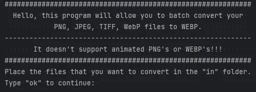
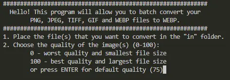

# 🖼️ Image to WebP Batch Convert

Batch convert static and animated images to .webp format using Google’s [libwebp](https://chromium.googlesource.com/webm/libwebp/) engine.

This lightweight Python tool uses the native binaries from [WebP’s official releases](https://storage.googleapis.com/downloads.webmproject.org/releases/webp/index.html), bundled inside the project (in the webp_convert folder). The latest included version is libwebp 1.5.0

# ✅ Features
* Batch convert images to WebP

* Supports static and animated formats

* Includes Windows binaries (via libwebp)

* Outputs a detailed report, including warnings for unsupported formats

* Works with png, jpeg, jpg, tiff, gif, and webp

* CLI-based, lightweight, and dependency-free (except for Python and Pillow)

# 📺 Demo

Click on the images bellow to see the tool in action:
- in order of appearance: Old demo, New demo
<br>
[](https://youtu.be/Tt3T_vvO8io)
[](https://youtu.be/S-FxQQeTzZw)

# ⚙️ Platform Support

🪟 Windows:

(fully supported out of the box)

🐧 Linux / macOS: 

You can adapt the config by modifying config.py to use system-installed WebP binaries or adjust paths accordingly.

# 📦 Usage

⚠️ Requires Python and Pillow installed.

1. Clone the repository
```bash
git clone https://github.com/chebishev/imageToWepbBatchConvert.git
cd imageToWepbBatchConvert
```
2. (Optional) Activate a virtual environment:
```bash
python -m venv .venv
.venv\Scripts\activate # or source .venv/bin/activate for Linux
```
3. Install dependencies
```bash
pip install -r requirements.txt
```
4. Run the script
```bash
python main.py
```
# 🚫 Notes
* Files not in the supported list will still be attempted, but you’ll get a warning in the report if output might be unusable.

* For animated GIFs, ensure the input file is valid and properly formatted.

# 📁 Structure
```bash
.
├── webp_convert/               # Contains extracted libwebp binaries (Windows)
├── config.py                   # You can set the libwebp path, default quality, input/ouput folders)
├── main.py                     # Main entry point
├── messages.py                 # all strings used in the main.py and initial_message.py
├── new_webp_batch_convert.webp # new demo thumbnail
├── requirements.txt            # Python dependencies
└── webpbatchconvert.webp       # old demo thumbnail
```
# 📝 License
MIT License © [Atanas Chebishev](https://github.com/chebishev)
