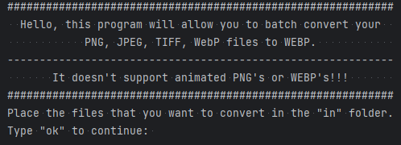

# imageToWepbBatchConvert
using the engine of google developers (https://developers.google.com/speed/webp/docs/cwebp) I've made a program that can do batch conversions of image files to webp's

supporting formats are "png", "jpeg", "jpg", "tiff", "webp"
animated png's and webp's are not supported.

